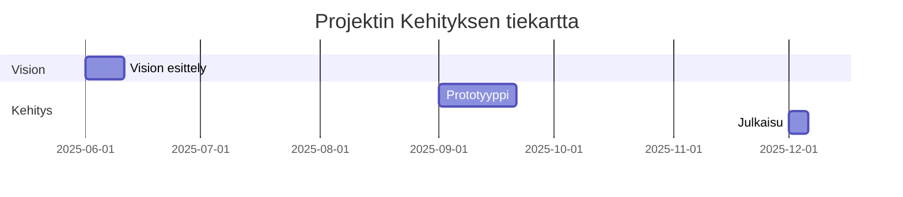

# projektin blueprint

Tämä dokumentti sisältää projektin nykytilan analyysin, implementointisuunnitelman ja tulevaisuuden näkymät.

*Nykytila*

*Implementointisuunnitelma*

## Kehityksen tiekartta

Tämä dokumentti kuvaa projektin etenemistä Mermaid-syntaksilla. Kehityksen tiekartta muodostetaan vision.md-tiedostossa esitetyn vision perusteella.

## Ohjeet Kehityksen tiekartan luomiseen

1. **Tunnista tavoitteet:** Määrittele vision.md:ssä esitetyt projektin tavoitteet ja kehitysvaiheet (esim. prototyyppi, testaus, julkaisu).
2. **Määrittele aikataulu ja vaiheet:** Kuvaa, miten eri kehitysvaiheet etenevät ja kuinka kauan ne kestävät. Suositeltavaa on käyttää Gantt-kaaviota.
3. **Kirjoita Mermaid-koodia:** Upota kaavio suoraan tähän tiedostoon. Alla on esimerkki Gantt-kaaviosta:

Muista päivittää kehityksen tiekarttaa, kun projektin vision tai kehitysvaiheisiin tulee muutoksia.
